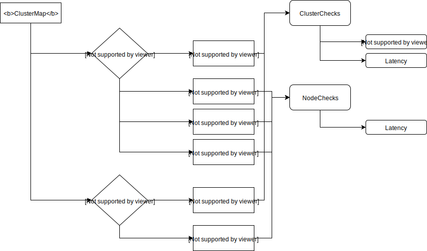
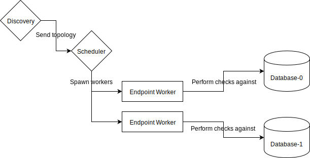

# Blackbox prober - A prometheus blackbox probe for distributed systems

## Introduction

The blackbox prober is both a framework for probes and also the implementation of probes for the
following databases:
| Database  | Maturity |
| --------- | -------- |
| Aerospike | Alpha    |

## Checks

The goal of the probe is to perform checks against multiple distributed systems clusters of the same kind. Those distributed system are typically databases.

Checks can be used to compute [SLIs](https://sre.google/sre-book/service-level-objectives/):
- Availability
- Latency
- Durability (dataloss)
- Replication durability/delay

Check can be executed at two levels:
- **Node**: executed every interval per node on each clusters.
Useful to calculate SLIs about a single node (such as latency)

- **Cluster**: executed every interval per cluster.
Useful to calculate SLIs about a whole cluster (such as durability)

# Usage

### Building
```
go build -o build/aerospike_probe probes/aerospike/*.go
```

### Running
```
$ build/aerospike_probe -h
usage: aerospike_probe [<flags>]

Aerospike blackbox probe

Flags:
  -h, --help               Show context-sensitive help (also try --help-long and --help-man).
      --web.listen-address="0.0.0.0:8080"  
                           Address to listen on for UI, API, and telemetry.
      --config.path="config.yaml"  
                           Path to the probe configuration file
      --log.level=info     Only log messages with the given severity or above. One of: [debug, info, warn, error]
      --log.format=logfmt  Output format of log messages. One of: [logfmt, json]
```
### Testing

```
go test ./... 
```

# Architecture

## Topology

The probe works with the concept of topology:


A ClusterMap contains the toplogy of the clusters discovered by the service discovery.
The prober will schedule checks (either cluster or node level) for each endpoints.

## Workflow




# Adding your own probe

Probes are defined in the probes/\<name of db\> directory.
The probes have to define 3 things:

## Endpoints

A implementation of the `toplogy.ProbeableEndpoint`. It contains the client 
(and everything necessary) to connect to the database. State, locks or
connections should not be shared between endpoints as it may affect recorded
latencies.

See [probes/aerospike/endpoint.go](probes/aerospike/endpoint.go) for an example

## Endpoint builder

The discovery is responsible for creating the topology. When creating a
discoverer, a builder function should be provided: 
`topologyBuilderFn func(log.Logger, []ServiceEntry) (topology.ClusterMap, error)`
This function takes all the service entries (services found by the service
discovery) and return a topology. A generic version of this function is
available:
```
GetGenericTopologyBuilder(
	ClusterFn func(log.Logger, []ServiceEntry) (topology.ProbeableEndpoint, error),
	NodeFn func(log.Logger, ServiceEntry) (topology.ProbeableEndpoint, error)
```

`ClusterFn` should generate a cluster level endpoint
`NodeFn` should generate a node level endpoint

See [probes/aerospike/discovery.go](probes/aerospike/discovery.go) for an example

## Checks

Example:
```
p.RegisterNewClusterCheck(scheduler.Check{
    Name:       "latency_check",
    PrepareFn:  scheduler.Noop,
    CheckFn:    scheduler.Noop,
    TeardownFn: scheduler.Noop,
    Interval:   config.AerospikeChecksConfigs.LatencyCheckConfig.Interval,
})
```
`scheduler.Noop` is a placeholder function

See [probes/aerospike/main.go](probes/aerospike/main.go) for an example
